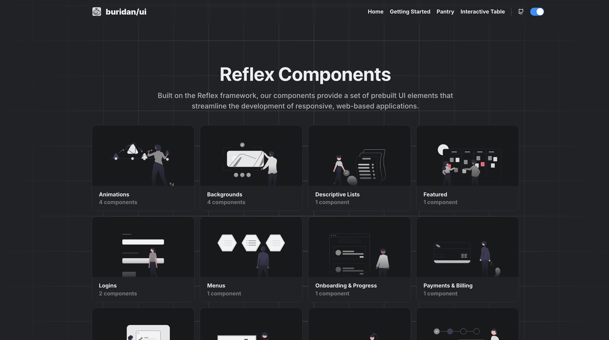

# buridan/ui  
___
 Pre-designed UI components built with Reflex. Easily copy and paste into your own app. 

  

## Pantry
___

Visit the [Pantry](https://buridan-ui.reflex.run/pantry/animations/) section to view the available pre-built components. 

## Contributing
___

Please read the [contributing guide](CONTRIBUTING.md) for more information on how to contribute. 

## License
___

Licensed under the [MIT license](LICENSE.md).